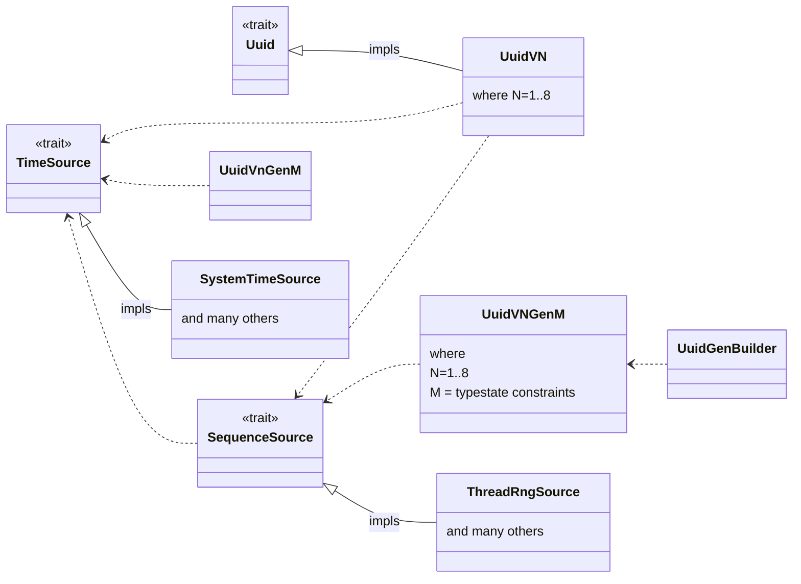

# Uuid API 2.0

## UuidGenBuilder and Uuid Version-Specific Refactoring

The goal of this doc is to lay out a refactored API for a potential Major Version release (read: Not necessarily backwards compatible, though it could be)

The three primary motivations are to create a new concept called UuidGen, which is, as you might guess, a Uuid Generator.  The second reason is to decouple the lower-level API components to make them more suitable for the 7 Uuid versions that we support. The third reason, similar to the second, is to future proof the API and make it easy to implement future, unknown Uuid standards.

In this new scheme, we would eliminate version-specific features.  All versions would be constructable by the API by default.  However, the functionality needed to construct Uuids lives in structs which may be gated by features.  E.g. std, rand, thread-rng, system-rng, atomics, etc.

In this new scheme, anything that isn't associated with a UuidVN struct/impl, Uuid trait, an implementation of TimeSource or SequenceSource, or a UuidGenBuilder, would be removed (though the existing functionality would roll into the above)

### UuidGen / Builder

The UuidGen and Builder types will incorporate **type-state** methods to safely construct a version-specific Uuid Generator which can generate new Uuids simply by calling `next()`

The motivation for this is four fold:

1. People rarely want to create 1 uuid, usually it's millions or more.
2. Presently, through either the Uuid struct or through the Builder, there are a fair amount of machinations required to create a single Uuid. I hope to demonstrate that one can make a generator with the same amount of effort.
3. Being synchronous, this generator can also implement an `Iterator` interface, which opens up a world of possibilities for "free".
4. Clock-sequence and rng generation are inherently stateful operations, so some sort of stateful context is needed to create Uuids. Might as well roll everything into a single instance.

The implementation of the `UuidGenBuilder` would involve quite a few structs, most of which represent a partially constructed, version-specific Uuid generator.
e.g.:

```rust
   let bldr: UuidV7GenBuilderNoClockNoSeq = UuidGenBuilder::new_v7();
   let bldr: UuidV7GenBuilderNoSeq<SystemTimeSource> = bldr.with_system_time();                  // assumes feature="std"
   let bldr: UuidV7GenBuilder<SystemTimeSource, rand::ThreadRng> = bldr.with_thread_local_rng(); // assumes feature="thread-rng"
   let gen: UuidV7Gen<SystemTimeSource, rand::ThreadRng> = bldr.finish();
   let u1: UuidV7 = gen.next();

   // or for `no features`

   struct MyTime {};
   impl TimeSource for MyTime {
	type Output = (u64, u32);
   	fn next() -> Self::Output {
	  ...
	}
   }
   struct MySequentialGen {};
   impl SequenceSource for MySequentialGen {
        type Output = u64;
        fn next() -> Self::Output {
	  ...
	}
   }
   let bldr: UuidV1GenBuilderNoClockNoSeq = UuidGenBuilder::new_v1();
   let bldr: UuidV1GenBuilderNoClock<MyTime> = bldr.with_seq_source(MySequentialGen {});
   let gen: UuidV1Gen<MyTime, MySequentialGen> = bldr.with_time_source(MyTimeSource {}).finish();
   let u2 = gen.next();

   // Note that all of these types are for illustration purposes really a user would just do

   let infinite_ids = UuidV1GenBuilder::new_v1()
       .with_seq_source(MySequentialGen {})
       .with_time_source(MyTimeSource {})
       .finish()

   let hundred_ids = infinite_ids.take(100).collect::<Vec<UuidV1>>();
```

So there would be probably 4 typestate structs per uuid version, and 8 versions, but they'd be very simple structs, as they'd exist to ensure that only the correct setters could be used.

The methods each struct impls would vary based on the requirements of its Uuid version, and what built-in functionality the user has enabled via features.

e.g.

```rust
struct UuidV6GenBuilderNoSeq<TS: TimeSource> {
  clock_source: TS
}

impl<TS: TimeSource> UuidV6GenBuilderNoSeq<TS> {
  #[cfg(feature = "thread-rng"]
  pub fn with_thread_local_rng(self) -> UuidV6GenBuilder {
  	let rng = rand::thread_rng();
	UuidV6GenBuilder {
	  seq_source: rng,
	  clock_source: self.clock_source,
	}
  }

  pub fn with_seq_source<S: SequenceSource>(self, src: S) -> UuidV6GenBuilder {
       UuidV6GenBuilder {
          seq_source: src,
	  clock_source: self.clock_source,
       }
  }
}
```


### New Supporting Traits:  TimeSource and SequenceSource

TimeSource and SequenceSource would be a disaggregation of the current ClockSequence trait

SequenceSource would be intended to serve both Monotonically Increasing Counters as well as Random Number Generators.
Both are (probably ) stateful sequence generators.

I am undecided how best to represent the outputs of the trait's methods.
There are 2 approaches:

1. Associated Type: Output
One approach would be to just have an associated type, Output.  This would certainly be generic enough to handle all cases, but it would be a bit more hassle to implement for both maintainers and users.
Though we could have on-hand implementations of the most common types and approaches.

```rust
trait TimeSource {
    type Output;
    fn next(&mut self) -> Self::Output;
}

trait SequenceSource {
    type Output;
    fn next(&mut self, conflict: Option<bool>) -> Self::Output;
}
```

2. Specifically typed methods and default implementations.
This would have default implementations for all functions where the values could be derived by the non-default-implemented function.
e.g. The required method for TimeSource would be `next_unix_time(&mut self) -> (u64, u32)`   then `next_rfc4122(&mut self) -> u64` would be implemented in terms of unix time.
     The required method for ClockSequence would be `next_u64(&mut self, (u64, u32)) -> u64` and then `next_u16(&mut self) -> u16` would be implemented in terms of a u64.
This would work, until it doesn't. In the future when we have more precise clocks and requirements for more precision for conflict-avoidance, then `next_unix_time()` won't be sufficient.

I'm leaning towards the Output associated type, but could be convinced either way.


### Uuid and lower-level functionality

In this new scheme, each Uuid's low-level details would be implemented in their own, versioned struct. The reason for this is that a V7 Uuid is technically a different type than a V1 Uuid, and shouldn't be used interchangibly.

In this new scheme, the Uuid struct would become a trait which all Versioned Structs implement, because even each versioned type is separate, they'd all have functionality in common.


### Refactoring Features

As mentioned previously,  any version-specific features would be removed. All Uuids would be contstructable using the toolkit, although the user might have to create their own implementations of the `TimeSource` and `SequenceSource` trait, if there aren't suitable features enabled.

- random : Hopefully we can consolidate all of our rng related dependencies onto `rand` which can optionally leverage getrandom and OS, but also no-std.
    - thread-rng  (use thread-local state for rng)
    - !std (if std is disabled, we should disable std in rand and fall back to the correct APIs)
    - os-rng  (use the OS's rng if present)
- wasm : We should offer a feature-set capable of running in very limited platforms such as wasm and js
    - **OPEN QUESTION** Can we support wasm via `rand` or will we need getrandom/js directly?
        - At first glance, it doesn't look like rand addresses wasm32 etc like getrandom does, but maybe it doesn't need to
- zerocopy
- atomic : Would prefer to use std::sync::atomic where possible
    - !std - The only currently supported target that seems to fail for std::sync::atomic is thumbv6m-none-eabi.
        It utilizes the horrible spinlookhack for compexchg created by the `atomic` crate. I am tempted to remove the `atomic` dependency and let those users implement `SequenceSource` on their own.

### Repository Shape

The new repository would look something like:

```
- src/
   - lib.rs     - contains the TimeSource and SequenceSource traits
   - uuidgen/
       - mod.rs
       - uuidgen.rs - defines the UuidGen struct
       - builder.rs - defines the UuidGenBuilder struct
   - uuid/
      - mod.rs  - contains the Uuid trait
      - v1.rs   - UuidV1 Struct and Trait Impl
      - ...
      - v8.rs
   - seq/
      - mod.rs contains (feature gated) impls of the SequenceSource traits
      - ...
   - time/
      - mod.rs
      - ...
```

#### API Layer



From an API layering standpoint,  the lowest level type would be `TimeSource` and `Uuid`, followed by `SequenceSource` which could use TimeSource's output.
The `UuidVN` structs would sit above, implementing the Uuid trait, and utilize impls of `TimeSource` and `SequenceSource`.
The specific `UuidVNGenM` impls would sit above,  and then the `UuidGenBuilder` structs would use that.

